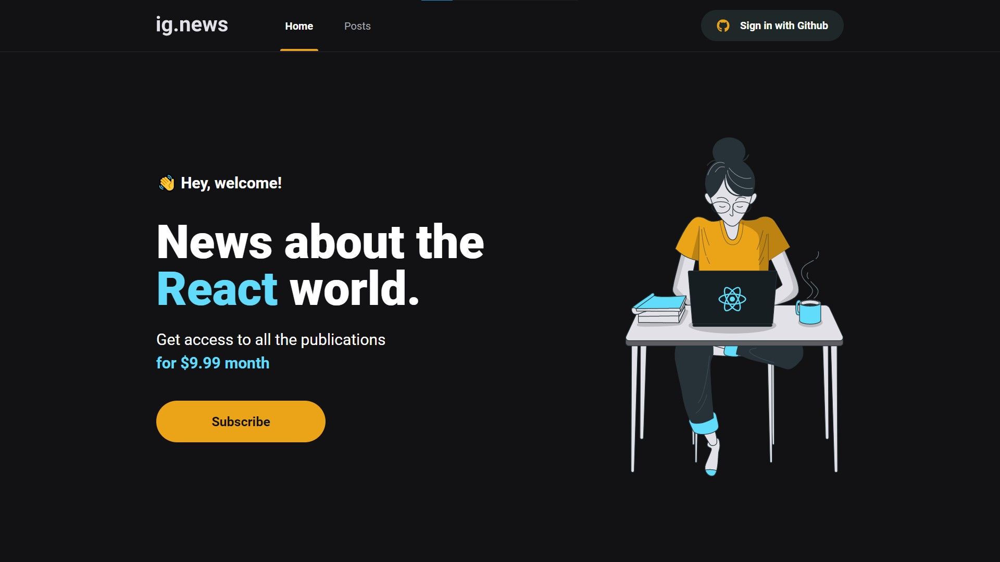

<div align="center">
  <h1>
    👩‍🚀 ignews — Ignite 🔥
  </h1>

  > Blog sobre notícias do universo React, construída na trilha de React JS do bootcamp Ignite da Rocketseat.
</div>

<div align="center">
  

  > <small>Tela inicial</small>
</div>

## 💡 Você vai precisar

- Primeiramente de uma xícara de ☕ bem quentinho;
- Do [Node JS](https://nodejs.org/pt-br/) instalado em sua máquina.

## 🎉 Começando

Clone o repositório:

```bash
git clone https://github.com/MattZ6/ignews
```

Adentre a pasta do projeto:

```bash
cd ignews
```

Instale as dependências:

```bash
yarn
```

## 🔥 Executando

Para executar a aplicação em ambiente de desenvolvimento (localmente):

```bash
yarn dev
```

## 🤝 Contribuição

Contribuições, issues e novas features são sempre bem-vindas! <br/>
Fique à vontade para explorar as [issues](https://github.com/MattZ6/ignews/issues).

## 👨‍🎤 Autor

Eu mesmo, [Matheus](https://github.com/MattZ6)! 👋
<br />
Quer conversar? [Chama aqui](https://www.linkedin.com/in/mattz6)!

## 📜 Licença

[Licença MIT](https://github.com/MattZ6/ignews/blob/main/LICENSE.md) © 2021 [Matheus Felipe Zanin](https://github.com/MattZ6)

___

<div align="center">
  <strong>Ignite Bootcamp 🔥</strong>
</div>
